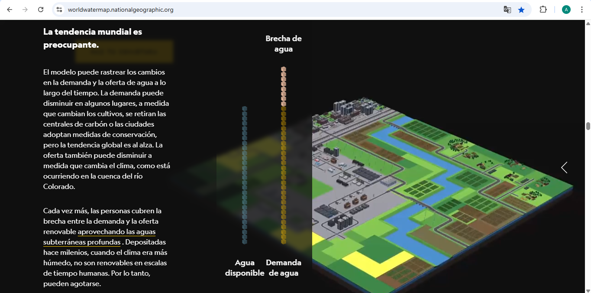
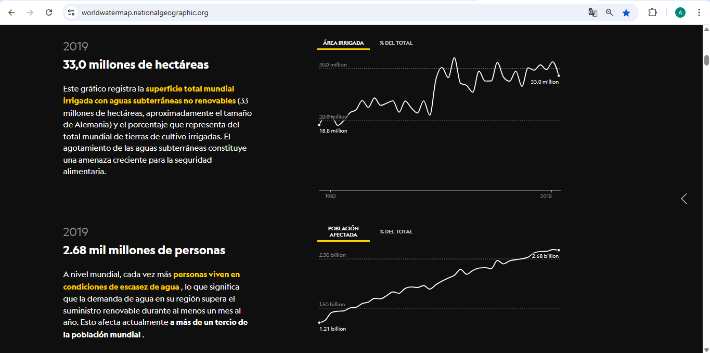
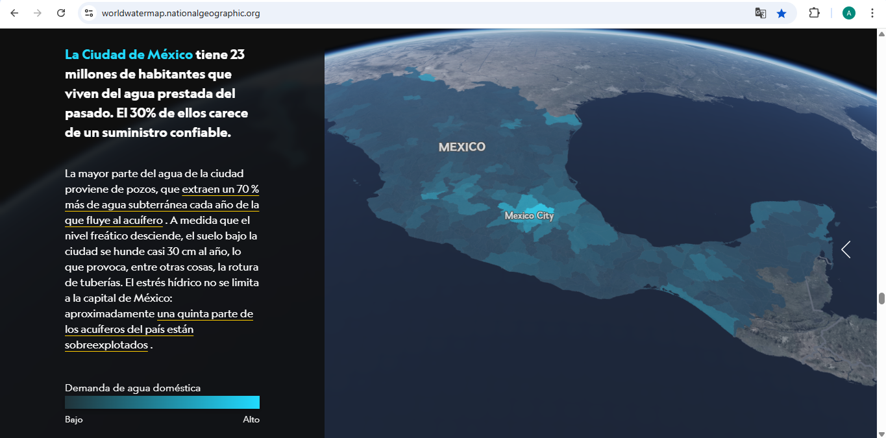

# Tarea 1 - Andrés Hernández
## URL: https://worldwatermap.nationalgeographic.org/

## Nombre de la webstory: **Mind the water gap**, mapping the world´s water shortages.

## Descripción: 

Esta historia visibiliza el problema de la escasez de agua en el mundo, mediante mapas y datos que ayudan a comprender, según dice el texto, dónde y por qué surgen las lagunas hídricas. 

Toda la información se basa en un modelo global desarrollado en la Universidad de Utrecht, Países Bajos. Este trabajo es dirigido por Marc Bierkens, explorador de National Geographic, lugar, además, donde se publica esta nota. 

La historia se sustenta en tres grandes temas. El primero de ellos dice relación con que el consumo humano de agua se ha disparado. En algunas partes del planeta, la demanda supera la capacidad de los ríos o las aguas subterráneas.

En segundo lugar, que los mapas nos ayudan a identificar los puntos críticos donde la brecha entre la oferta y la demanda es mayor. Detectar un problema es un primer paso para solucionarlo.

Y por último, lo que pueden hacer las comunidades y los países de todo el mundo para cerrar la brecha hídrica,  utilizando los datos del modelo Utrecht.

## Lo destacado:

Esta historia me pareció interesante porque da a conocer una realidad que nos afecta como humanidad. Lo hace mostrando datos de manera interactiva y poniendo el sentido de urgencia sobre las brechas de agua, las que surgen cuando la demanda humana excede el suministro renovable (de ríos, lagos y acuíferos poco profundos refrescados por la lluvia).

De la estructura narrativa destaco que es fácil de leer y seguir, la información se presenta a medida que se desliza. Además, los gráficos y mapas son sencillos de entender. Creo también que se utiliza muy bien el recurso de explicar mediante imágenes.

Es una historia web que combina muy bien todos los elementos visuales y utiliza el texto de manera precisa, lo que no vuelve tediosa la lectura, tal como se aprecia a continuación.

*Mind the water gap, mapping the world´s water shortages, National Geographic.*

Los gráficos están muy bien utilizados y son interesantes de apreciar, ya que dan a conocer, por un lado, que 33 millones de hectáreas, aproximadamente el tamaño de Alemania, es la superficie total mundial irrigada con aguas subterráneas no renovables. Por otro, que más de un tercio de la población mundial vive en condiciones de escasez de agua.

*Mind the water gap, mapping the world´s water shortages, National Geographic.*

Todo esto es un claro ejemplo de que la interacción con el usuario se logra de buena manera, hay calidad y sencillez en los contenidos presentados y, por último, un equilibrio óptimo entre texto e imágenes.

## Evaluación 

Esta historia transmite de manera efectiva la información, ya que nos introduce como lectores en la importancia del tema y nos entrega datos orientadores para tomar una posición al respecto.

Además, capta la atención al leerlo, ya que da a conocer, por ejemplo, los puntos críticos de brecha de agua en todo el mundo. En mi caso personal, me sorprendió la situación actual en la Ciudad de México, realidad no muy distante geográficamente de la nuestra.

*Mind the water gap, mapping the world´s water shortages, National Geographic.*

Por último, destaco que la nota referencia los datos subyacentes del Mapa Mundial del Agua, que están disponibles públicamente como un paquete de datos con un DOI persistente (https://doi.org/10.24416/UU01-0Q6SU6) en el servidor YoDa de la Universidad de Utrecht (https://public.yoda.uu.nl/geo/UU01/0Q6SU6.html). Esto ayuda al lector para sacar más conclusiones e interesarse en el tema. 